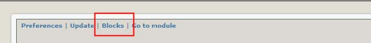
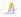
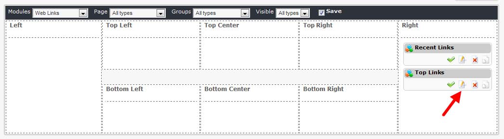
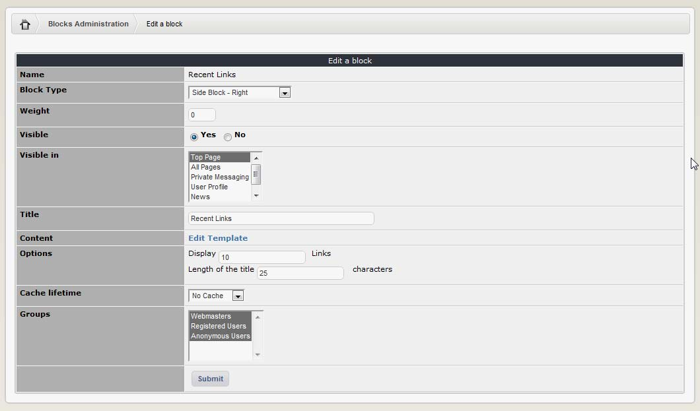

# Blocks

The MyLinks module has two blocks:

| Block | Its purpose |
| --- | --- |
| Recent links | Displays a list of the most recently added links. |
| Top links | Displays a list of the most frequently visited links \(by number of hits\). |

And then clicking on the “Edit” icon: 

Now the “Block Edit” screen will open up:

