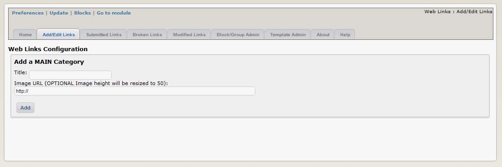
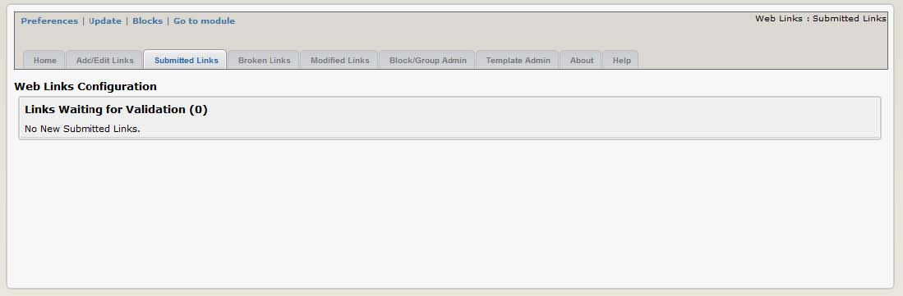
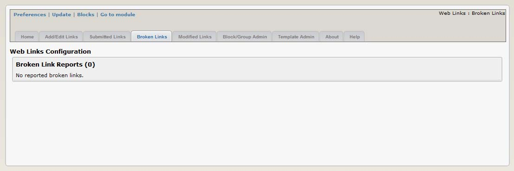
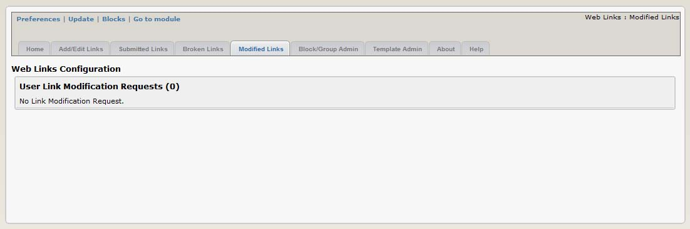
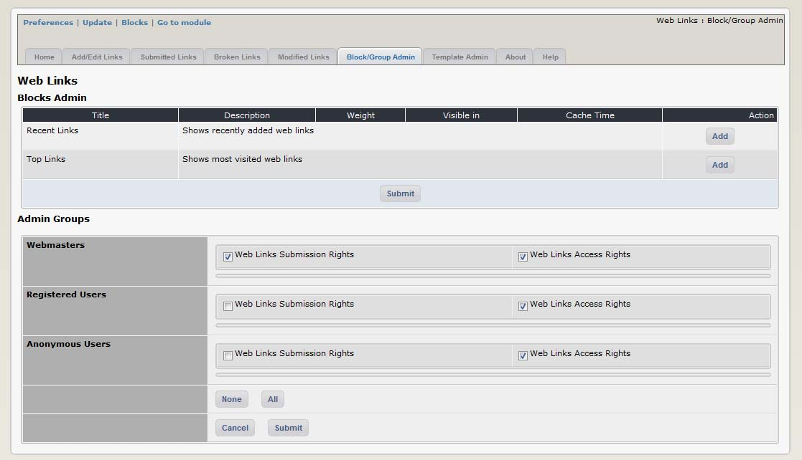
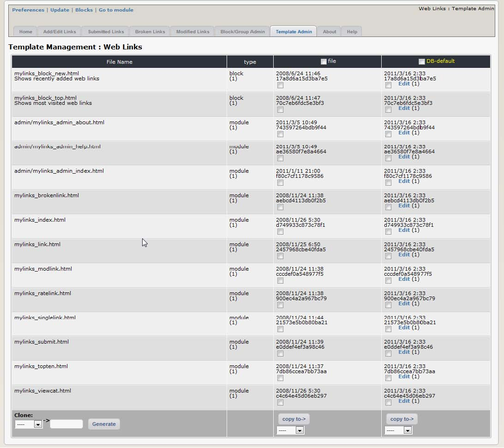
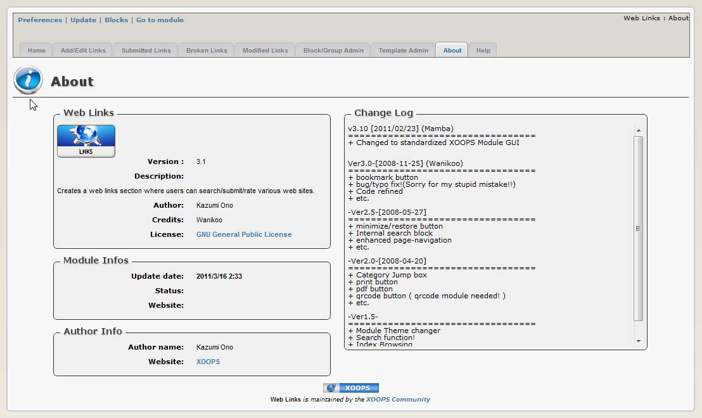
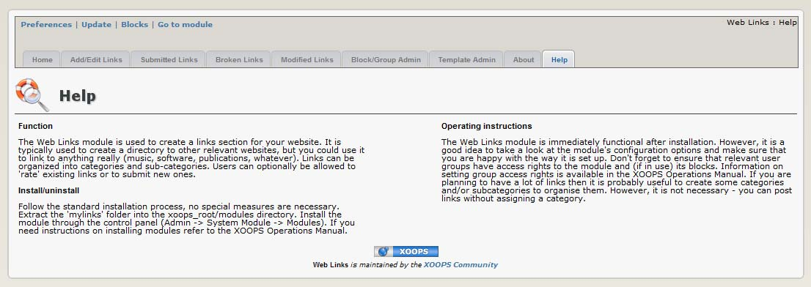

# 2.0 Administration Menu

There are for options on top:

|Option|	Action|
|---|---|
|Preferences|	Here you can configure your preferences for the module|
|Update|	Click here if you’ve made some changes to the module, uploaded new files, etc. – this will recompile the module and update all entries in the database |
|Blocks|	When you click here, it will redirect you to the Blocks section of XOOPS, and select the blocks related to your module|
|Go to module|	If the module is visible on the user side, this will take you there|

There are five Tabs in the Administration of the MyLinks module: 
-	Home
-	Add/Edit Links
-	Submitted Links
-	Broken Links
-	Modified Links
-	Block/Group Admin
-	Template Admin
-	About 
-	Home

    

**Figure 4 View of the “Add/Edit Links” Tab**

   

**Figure 5 View of the “Submitted Links” Tab**

   

**Figure 6 View of the “Broken Links” Tab**

   

**Figure 7 View of the “Modified Links” Tab**

   

**Figure 8 View of the “Block/Group Admin” Tab**

   

**Figure 9 View of the “Template Admin” Tab**

   

**Figure 10 The “About the Module” Tab**

   

**Figure 11 The “Help” Tab**

