# 4.0 Operating Instructions

The MyLinks module is immediately functional after installation. However, it is a good idea to take a look at the module's configuration options and make sure that you are happy with the way it is set up. Don't forget to ensure that relevant user groups have access rights to the module and (if in use) its blocks. Information on setting group access rights is available in the XOOPS Operations Manual.

If you are planning to have a lot of links then it is probably useful to create some categories and/or subcategories to organize them. However, it is not necessary - you can post links without assigning a category.
 
**Add/Edit Links**

Selecting ‘Add Partner’ opens a submission form (shown below) 
This page of the administration interface is divided into five sections, each with its own submit button (variously labeled 'add' or 'modify'. Here is what you can do:

**Add a main category**

To create top-level categories to organize your links, simply enter the name of the category in the text field and simply press 'add'. You can, if you wish, display a category image or icon next to it, by entering the link to the image in the box below. You can link to any image, so if you are using consistent categories throughout your site you could link to an icon housed in another module, but if you wanted to make the MyLinks module fully independent it is probably a good idea to place a copy of any icons used in the XOOPS_root/modules/mylinks/images folder, or upload them to the image manager (System module => Images).

The 'Image URL' box indicates that there is an 'option' to resize images down to 50 pixels in width, but actually there is actually no way to turn this off through the admin interface and it tends to make icons look fuzzy and ugly. If you use icons here it is best to design some that 'work' visually at 50 pixels in the first place, and resize them manually.

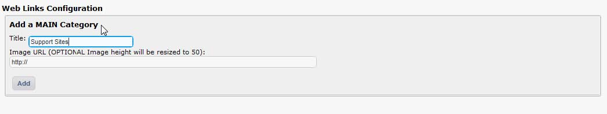  

**Add a sub-category**

Just enter the name of the sub-category, then choose its parent category from the drop-down box and press 'add'. You can have multiple levels of subcategory.

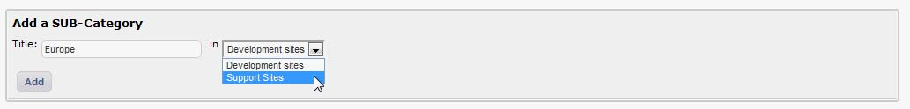  
 
**Add a new link**

Just fill in the title and URL, select a category (optional) and press 'add' to put a new link on your website. Bear in mind that the description is searchable by the XOOPS main search engine, so a good description will help your visitors find the link easily. You can, optionally, display a screenshot of the site using the drop down box to pick the appropriate image. To make a screenshot available for selection, save it with your favorite image editor into the directory:
http://xoops_root/xoops/modules/mylinks/images/shots/ 
Leave the screenshot dropdown box blank if you don't have one, or don't want to display one.
 
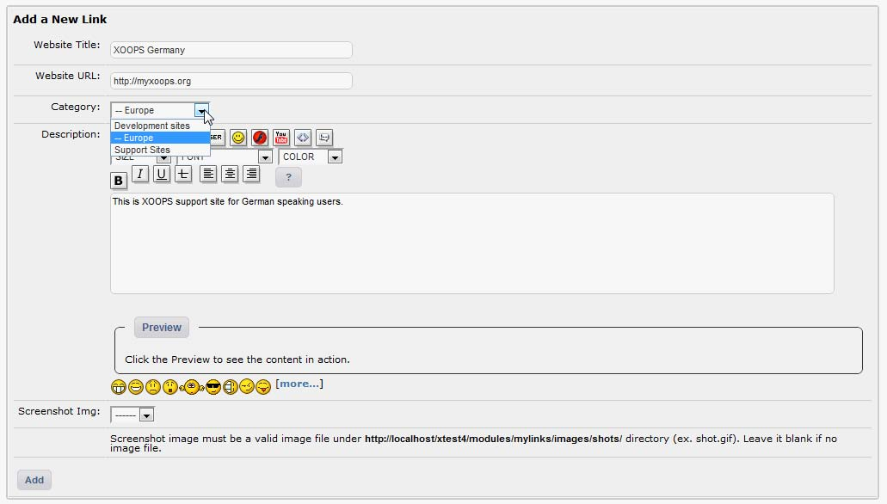  

**Figure 13 Form to add a new link **

**Modify category**
Select a category to modify using the drop down box, and press 'modify'. You can rename the category and change its category icon here.

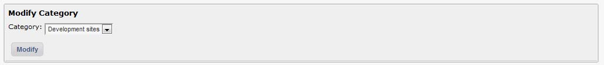  
 

**Modify link**
This is sort of redundant as it is actually a lot easier to edit links directly through the user side - you can locate the link you want to edit using the search box, then click on the red 'edit' icon   next to the 'Description' field name to open it for modification (so long as you are logged in as an administrator). However, you can enter the ID number of a link here to open it for editing if you want to. Problem is, you probably don't know the ID (for the record, you can get it by opening an individual link on the user side and looking at the end of the URL for the pattern '&lid=X', where X is the ID, or by looking directly in the database. 

Just edit links through the user side :)

The 'modify link' form is nearly identical to the 'add link' form shown above. Make your changes then select the 'modify' button. There is also a 'delete' button if you wish to remove the link entirely, and a 'cancel' button to abandon your edits. However, there is some additional information displayed about 'Link Votes'. This displays the total number of votes, and for registered users: Who voted, their IP number, the rating they gave, a timestamp and the overall average rating. For anonymous users only the IP number, rating and date are logged. Users can only vote for each link once (though this is tied to IP address for anonymous users).

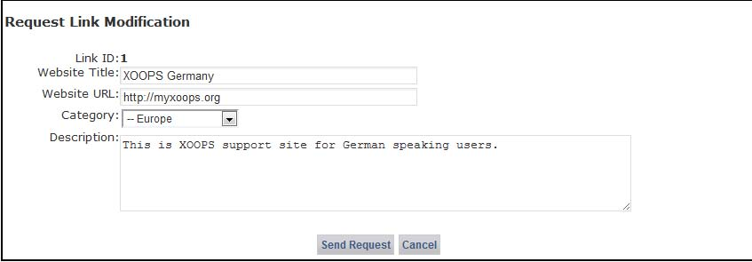  
 
**Figure 14 Form to request link modification**

**Submitted links**

This is an ‘editorial area’ where you view and manage links submitted by users. If you do not allow automatic publishing of submitted links (set in the preferences menu), they will be held here until you approve them. Make any desired changes then press the ‘approve’ button to make it publish it on your site – or you can delete it, if necessary.

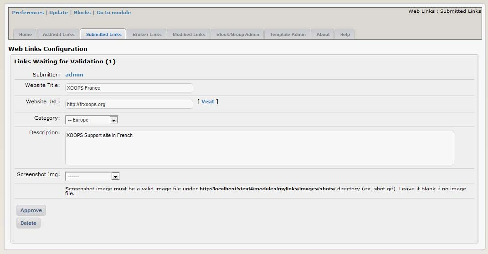  
 
**Figure 15 Tab showing links that need to be validated**

**Broken links**

Broken link reports submitted by users are displayed here. There are three options for dealing with the reports. 

-	Ignore - if the broken link report is false (it’s a good idea to check because they often are), select ‘ignore’ to delete it.
-	Edit - opens the link description so that you can amend it, e.g. change the URL.
-	Delete – be careful! This permanently deletes the report and the link from your database.-	

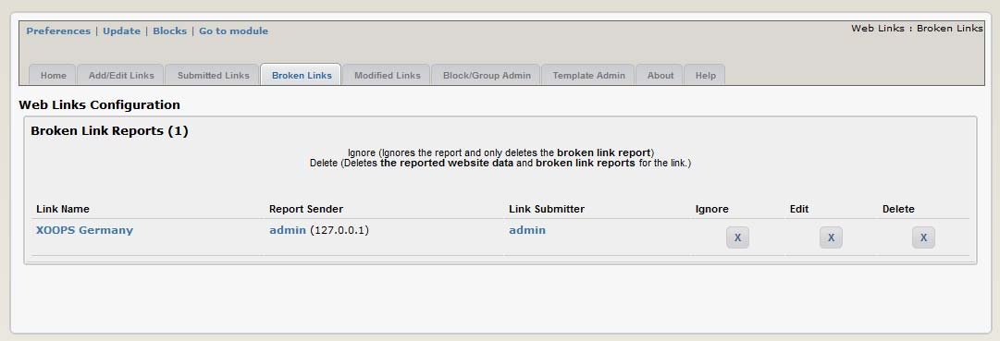  

**Figure 16 Tab showing broken links**

**Modified links**

User-proposed amendments to links are managed here. Both the current and proposed descriptions are displayed. Your options are:

-	Approve – accept the proposed change.
-	Edit – revise the description yourself.
-	Ignore – reject (delete) the proposed amendment.

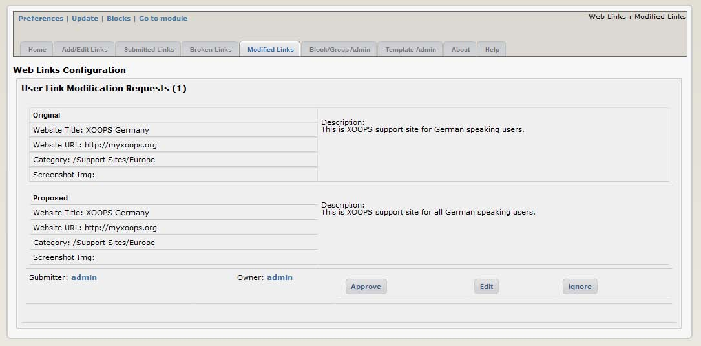  

**Figure 17 Modified links waiting for approval**

Now it’s time to make the Partners visible to the users.
This is done by using blocks (see the section Blocks for more information). Please click on the “Blocks” link:

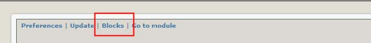  
 

You’ll be redirected to the Blocks screen, with the XOOPS Partner block already filtered out for you: 

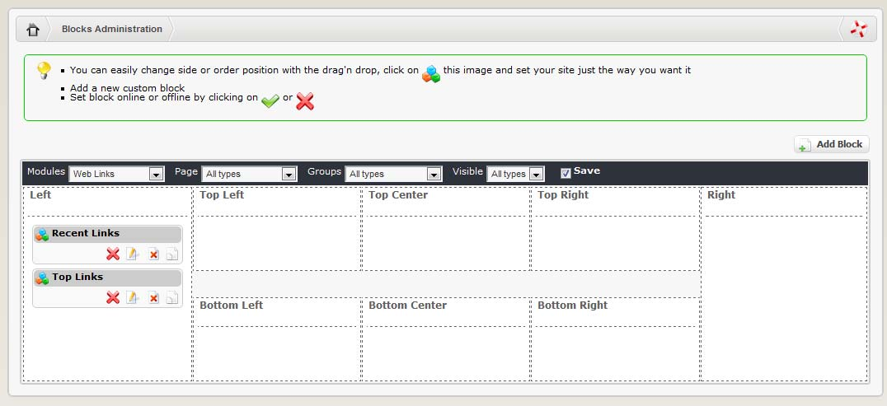  

MyLinks Module provides you with only one block. First, let’s move the block to the Right position, and set the block to be visible by clicking on the “visibility” icon, which can have two states:
 
|Icon|Action|
|---|---|
|  |  Visible (on-line)|
|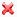  |  invisible (off-line)|

Now that we have it visible, let’s edit it by clicking on the “Edit” icon:   
 

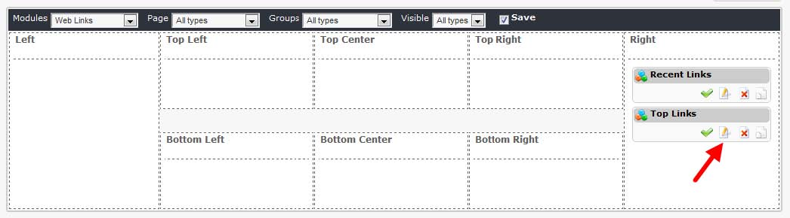  
 
Now the “Block Edit” screen will open up:

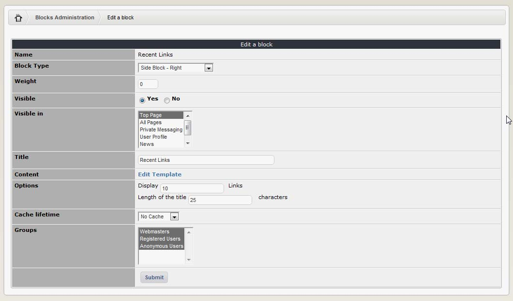 
  
These are the most frequently used custom options related to module that we can change:

|Option|Function|
|---|---|
|Title |  Change the title of the block|
|Options  | 	Diced how many links to you want to show in the Block, and what should be the length of the link’s title|

Most of the time you can leave it as it is.

