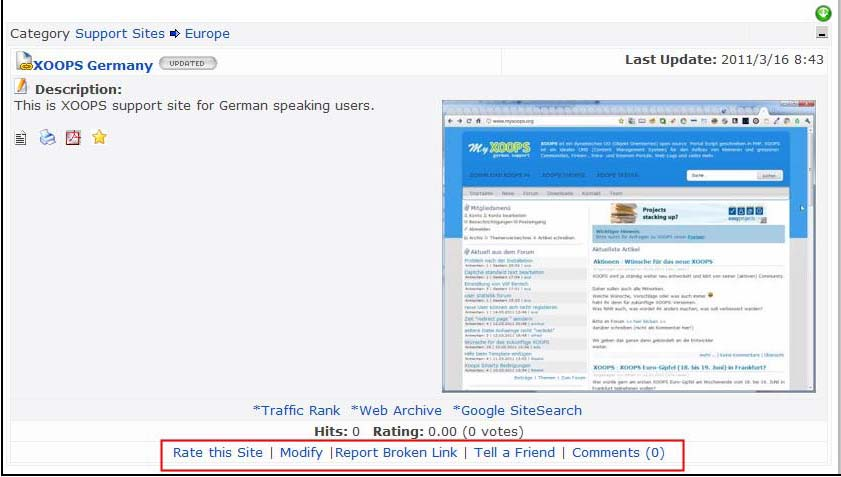
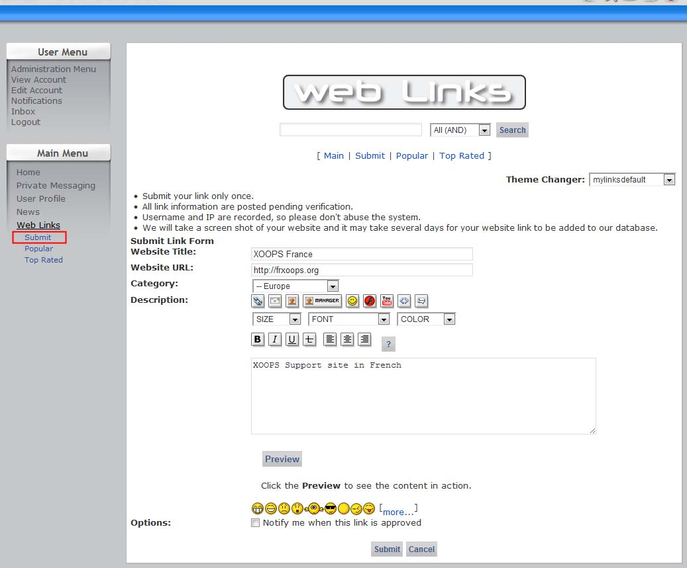

# 5.0 The User Side

  

**Figure 18 The user view**

**Rate this site**

This opens a form that allows the user to rate the site on a scale of 1-10. Each link displays the average user rating and number of votes.

**Modify**

This allows a user to request a modification to a link. It opens a form containing the link description, which the user can edit and submit. Proposed modifications are held until approved (or deleted) by an administrator (see ‘modified links’ above).

**Report broken link**

Opens a simple confirmation screen allowing users to report broken links – a very handy features that gets the community involved in keeping your site up to date. Reports are held pending the attention of an administrator (see ‘broken links’ above).

**Tell a friend**

Launches the user’s email client and opens a new message with the default text ‘Here is an interesting website link I have found at XOOPS Site: <relevant URL>’.

**Comments**

Users can post comments on links, if comments are enabled for this module (see ‘preferences’ above).

**Submit**

If the Administrator allows that, the user can submit links to their Websites, which might require approval by the administrator: 

  

**Figure 19 Submitting a new link by the user**

