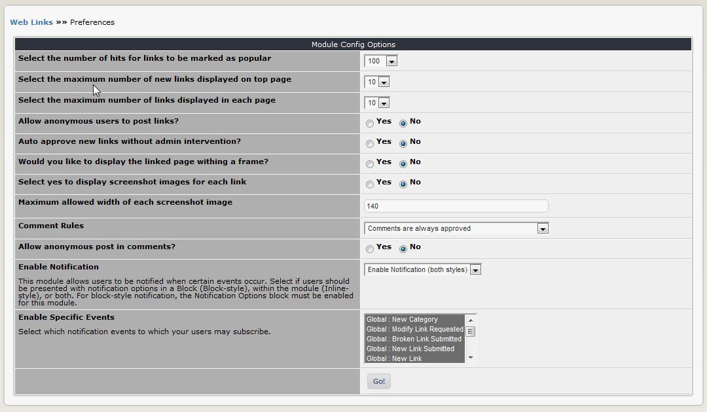

# Preferences

In the Preferences, you can set the most important options for the module, such as the number of entries per page.

**Figure 12 The Preferences options**

## Module configuration options

| Option | Description |
| --- | --- |
| Select the number of hits for links to be marked as popular | An icon   will be displayed next to links that reach a certain threshold of clicks. You can set the threshold at various levels ranging from 5 to 1000. Default is 100. |
| Select the maximum number of new links displayed on top page | The index page of the MyLinks module displays the most recently added links. How many do you want to show ? There are several options ranging from 5 to 50. Default is 10. |
| Select the maximum number of links displayed in each page | If you have a lot of links in a category the page can get very long. You can choose to 'break up' a long list by limiting the number of links displayed on a page. Choose between 5-50 \(default is 10\). If there are more, a series of 'next page' links will be displayed at the bottom. |
| Allow anonymous users to post links? | Yes or no \(default\).You can optionally allow users to submit links to your site \(via the ‘submit’ sublink in the main menu\). In a community site this can be a useful way to gather information. |
| Auto approve new links without admin intervention? | Yes or no \(default\). Do you want user-submitted links to be automatically published ? If so, select 'yes', but note that this leaves your site open to spamming by robots, antisocial individuals and people trying to sell things. If you select 'no' then user submissions will be held in the 'submitted links' section of the administration menu pending approval by an administrator \(see below\). This gives you a chance to review whether the link is useful or appropriate, fix the spelling and formatting. It is useful to make the 'waiting contents' block \(system module\) visible to administrators on the user side of your website so that you can easily see when links are submitted. |
| Would you like to display the linked page within a frame ? | Yes or no \(default\). The default behaviour is to open the linked site in a new window. The advantage of opening the linked site in a frame is that you retain your logo / some navigation features back to your own site. The downside is that a lot of people really hate frames \(particularly people that surf the web on mobile devices\). |
| Select yes to display screenshot images for each link | Yes or no \(default\). Do you want to display screenshots of each linked site ? Note that this option won't do anything unless you actually prepare the screen grabs for each link and save them in the right folder on your website \(see 'add a new link' below\). |
| Maximum allowed width of each screenshot image | Enter a width in pixels, the default is 140. If the screenshot is wider than permitted it will be resized down when displayed, which is inefficient in terms of file size and page loading times. It is best to manually resize your screenshots to match the intended display size, prior to uploading them. |
| Comment rules | Users can optionally be allowed to post comments on links. You can control the handling of comments here. Options include:  Disable comments - turn it off.   Comments are always approved \(default\) - user comments will automatically be published. Comments are often used as an ad-hoc discussion forum betweeen users. Adding a layer of 'editorial approval' can slow or kill the discussion, so many sites choose to allow comments to be posted freely, in a similar manner to a discussion forum. This is the least 'spam secure' option. Note that you can prevent anonymous users from posting comments separately \(see 'allow anonymous post in comments ?' below\).    Comments by registered users are always approved - but comments posted by anonymous users \(if allowed\) will be held pending approval by an administrator.  All comments need to be approved by administrator - the most spam-secure option, but also the slowest - not a good choice if you are trying to promote discussion. |
| Allow anonymous post in comments? | Yes or no \(default\). Standard practice on community sites is to require users to register before they are allowed to post comments for security reasons, as this gives you some options for dealing with antisocial individuals. However, you can allow unregistered users to post comments if you wish \(select 'yes'\). |
| Enable notification | The notification system allows registered members to 'subscribe' to different kinds of events on the website. An example of an event could be the addition of a new link in a particular category \(kinds of events are detailed below\). When an event occurs subscribers will automatically be notified via an email or personal message, depending on the preference set in their personal profile, which will contain a direct link to the relevant page. This allows members to track topics of interest without having to monitor the website constantly. It is also a very useful tool for administrators. Members can subscribe to events wherever the ‘Notification Options’ block is displayed on a page. There are several options for how this block is displayed: Disable notification – turn it off. The Notification Options block will not be accessible within this module. Enable only block-style – the Notification Options block \(actually part of the System module\) can be freely positioned on the page just like any other block \(through Administration =&gt; System =&gt; Blocks\).   Enable only ‘inline-style’ – the notification options block will be displayed in a fixed position at the bottom of the page, below the module contents. It cannot be moved.  Enable notification \(both styles\) – the Notification Options block will be available both at the bottom of the page and as an independently positioned block. |
| Enable specific events | Administrators can control they type of notification events that members may subscribe to. Select the options that you would like to appear in the Notification Options block \(CTRL + click to select multiple\). The available notification options are:  Global: New category - when any new category is created.  Global: Modify link requested - when a user submits an amendment to a link. This is of most use to administrators, so that amendments can be dealt with quickly.  Global: New link submitted - when a user submits a new link \(if user submissions enabled\). Of most use to administrators responsible for moderating user submissions.  Global: New link - when any new link is posted.  Category: New link submitted - when a user submits a new link in a particular category \(if user submissions enabled\). Of most use to administrators.  Category: New link - when a new link is posted in a particular category.  Category: Bookmark - this option does not generate notification messages. However, the category will be listed as a 'bookmark' in the member's notification options \(accessed via the user menu\), making it easy to return to the category.  Link: Comment added - when a comment is posted on a particular link.  Link: Comment submitted - when a user submits a comment on a particular link. As above, of most use to administrators when moderation is enabled.  Link: Bookmark - this just lists an individual link in a member's notification options, no notification messages will be sent. |

